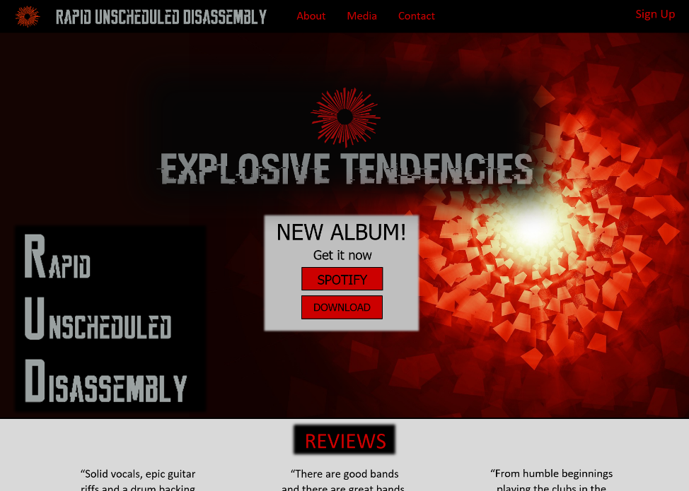
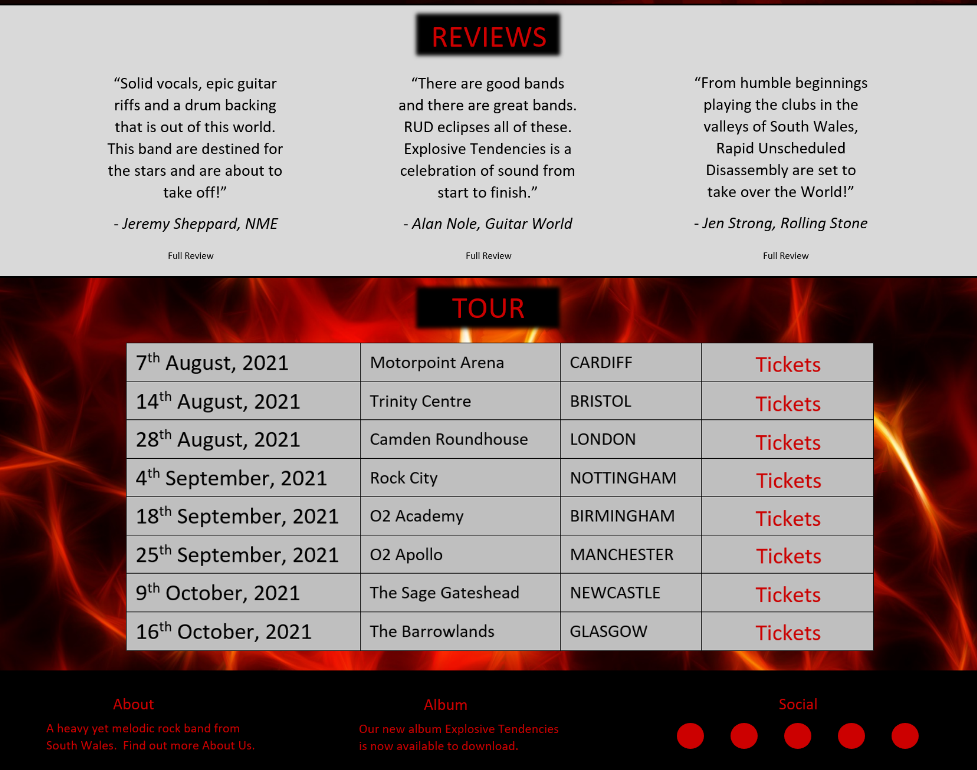
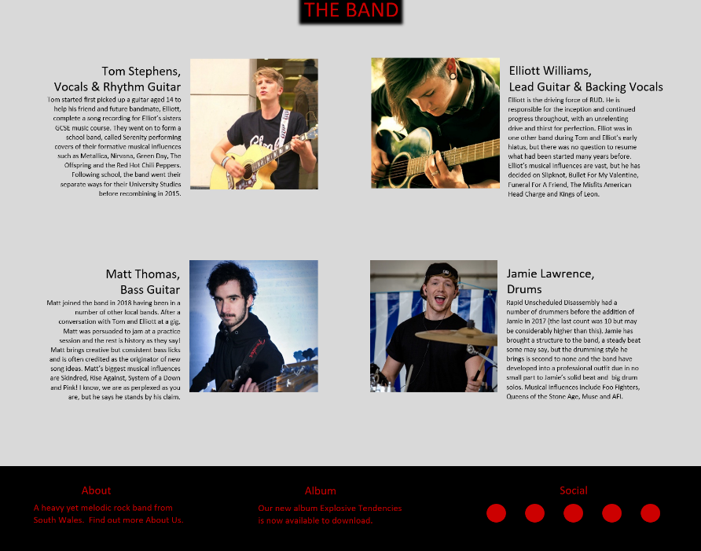
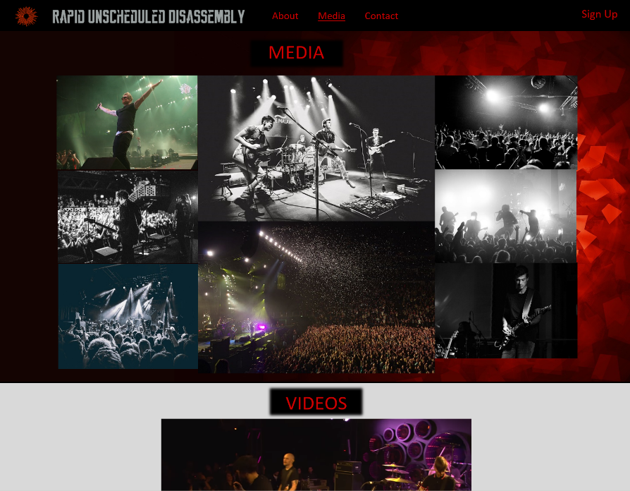
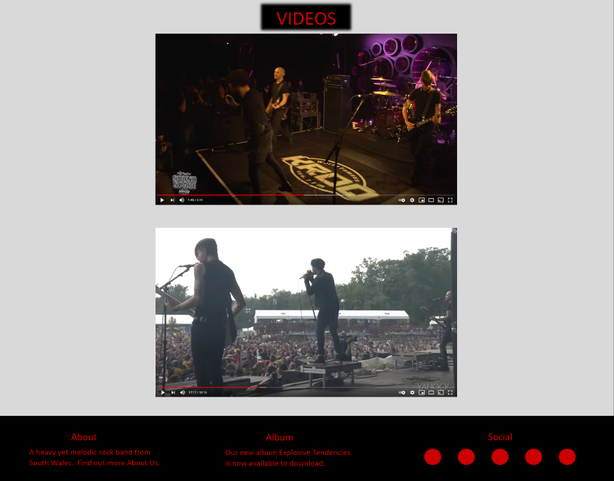

# Test to check repository has been branched


# Rapid Unscheduled Disassembly - Band Website
One or two paragraphs providing an overview of your project.

I will plan, code and implement a website for a fictional band. The website will be a central hub of information for everything regarding the band's activities.

--------  Essentially, this part is your sales pitch. --------
---

## UX

The website will have a target audience of existing fans, new fans and event organisers looking to book the band.

- Existing fans will be able to get more information on the band including a list of upcoming live performances. As well as becoming a member for 'exclusive content'.

- New fans will be able to read up on the history of the band and view images and videos of the band's live performances, with links to social media pages for greater interactivity.

- Event organisers will be able to contact the band via a form, for enquiries on availability and to start the booking process.


-------- Use this section to provide insight into your UX process, focusing on who this website is for, what it is that they want to achieve and how your project is the best way to help them achieve these things. --------

-------- In particular, as part of this section we recommend that you provide a list of User Stories, with the following general structure: --------

#### User Stories

- "I have been a fan of RUD since the beginning and want to know when they are playing my hometown next so I don't miss the chance to buy tickets."

- "I have just heard of this band through Facebook and liked their sound. I want to know more about them and see hear more songs."

- "As the Event Manager for the new Swansea Arena, I would like to book the band for Arena's launch. I have a specific query and would like a way to contact the band or their manager."

-------- As a user type, I want to perform an action, so that I can achieve a goal.

#### Mockups

Three webpages were first developed using a wireframe to assertain how the layout of the website will fit together.

Following this, mockups of the three webpages were constructed.

Home Page (top)


Home Page (Bottom)


About Page (top)


About Page (Bottom)


Media Page (top)


Media Page (Bottom)


---

## Features
In this section, you should go over the different parts of your project, and describe each in a sentence or so.

#### Existing Features

Every page will have the same navigation bar at the top and footer at the bottom.

The Home page:
- a welcome promoting the new album. Links will allow users to download the album from external sites.
- Reviews section will give an insight into the reception from professional journalists.
- A Tour Schedule will allow users to view dates and locations of upcoming live show with a link to buy tickets on an extarnal site. 

The About page:
- will include a brief history of the band, from its origins to its present success.
- has a picture of the band together to give the user an idea of the band's line-up.
- Each member of the band will have a short biography to explain their band role, history and influences.
- Each band member will have a profile picture to accompany the biography to give the user further information.

The Media page:
- A selection of photographs from live shows will give the user a feel of the band's level of performance.
- Two videos of live performances will be included to give the user direct access to content.


#### Yet to be Implemented
The Contact page:
- Has yet to be addressed but is planned to be completed in the future.
- It will include a method of contacting the band and its management via a contact form.
- Contact details of Management may also be included.

Sign Up button:
- A sign up to become a member may be included to enhance the user experience by providing exclusive content.
- The sign up form will open in a modal.

A Member's page:
- will provide exclusive content to users who have signed up.
- such users will have to opportunity to prebook tickets for live performances. 

---

## Technologies Used
- [Balsamiq](https://balsamiq.com/wireframes/) was used to create the wireframes.
- [Microsoft Word](https://www.microsoft.com/en-gb/microsoft-365/word) was used to construct the mockups as the ability to add text, shapes, pictures, colour and effects is useful in getting a detailed idea of layout.
- [Gitpod](https://gitpod.io/) is used as an online IDE as a platform on which to code.
- [Namecheap](https://www.namecheap.com/logo-maker/app/) was used to create the band's logo.
- [VS Code](https://code.visualstudio.com/) is used by Gitpod as it's IDE.
- [Boostrap 4.5](https://getbootstrap.com/docs/4.5/getting-started/introduction/)
- HTML5 is a markup language has been used to structure and present the content of the webpage.
- CSS3 (Cascading Style Sheets) is a style sheet language used for describing the presentation of a document written in HTML.
- [JavaScript](https://www.javascript.com/) is a high-level programming language and has been used to add a small amount of interactivity.

In this section, you should mention all of the languages, frameworks, libraries, and any other tools that you have used to construct this project. For each, provide its name, a link to its official site and a short sentence of why it was used.

---

## Testing

- W3C testing for the code.
- CSS testing
    W3C CSS Validator was used to test for errors. The test found several small errors and were quickly corrected or deleted. The successful test result can be found [here](http://jigsaw.w3.org/css-validator/validator$link)
- Lighthouse (Dev Tools)
- User Stories

In this section, you need to convince the assessor that you have conducted enough testing to legitimately believe that the site works well. Essentially, in this part you will want to go over all of your user stories from the UX section and ensure that they all work as intended, with the project providing an easy and straightforward way for the users to achieve their goals.

Whenever it is feasible, prefer to automate your tests, and if you've done so, provide a brief explanation of your approach, link to the test file(s) and explain how to run them.

For any scenarios that have not been automated, test the user stories manually and provide as much detail as is relevant. A particularly useful form for describing your testing process is via scenarios, such as:

Contact form:
Go to the "Contact Us" page
Try to submit the empty form and verify that an error message about the required fields appears
Try to submit the form with an invalid email address and verify that a relevant error message appears
Try to submit the form with all inputs valid and verify that a success message appears.
In addition, you should mention in this section how your project looks and works on different browsers and screen sizes.

You should also mention in this section any interesting bugs or problems you discovered during your testing, even if you haven't addressed them yet.

If this section grows too long, you may want to split it off into a separate file and link to it from here.

---

## Bugs

The heading blur (box-shadow) could not be styled using an id or class in the style.css file. The problem was resolved using a direct style on the element in the html files however this is not ideal and will be further investigated.

## Deployment

This project was developed on [Gitpod](https://gitpod.io/) using the [VS Code](https://code.visualstudio.com/) IDE. It was committed to git and pushed to [Github](https://github.com/) using the built-in Gitpod function.

To deploy the website to [Github Pages](https://pages.github.com/) the following steps were taken.

1. Log in to Github.
2. From the list of repositories, select **lukdav/RUD-band**.
3. Select **Settings** from the right hand side of the menu near the top.
4. Scroll down to the **Github Pages** section.
5. Under **Source**, click the drop-down menu labelled **None** and select **Master Branch**.
6. Click **Save** and the page automatically refreshes.
7. Scroll back down to the **Github Pages** section to retrieve the link to the deployed site.

Note: the deployment of a website is not instant and can take up to 20 minutes.

At the moment of submitting the User Centric Milestone Project, both the Developement Branch and the Master Branch are identical.

### How to run this project locally

To clone this project from GitHub:

1. Follow this link to the [Project GitHub Repository].
2. Next to the green Gitpod button, open the drop-down marked **Code**.
3. In the Clone with HTTPS section, copy the URL for this repository.
4. In your local IDE open Git Bash.
5. Change the current working directory to the location where you want the cloned directory to be made.
6. Type `git clone` and then paste the URL you copied in step 3.

    ```git clone https://github.com/lukdav/RUD-Band.git```

7. Press Enter. Your local clone will be created.

Further reading and troubleshooting on cloning a repository can be found [here](https://docs.github.com/en/github/creating-cloning-and-archiving-repositories/cloning-a-repository).


---

## Credits

#### Content
The text for section Y was copied from the Wikipedia article Z

#### Media
As this is a fiction band's website, all images and videos on this site are of various different bands.
The photos used in this site were obtained using google free image search (creative commons licences) and can be found at the following links:
- [band1](https://en.wikipedia.org/wiki/File:American_Hard_Rock_band,_Alpha_Centauri,_2012.jpg)
- [band2](https://commons.wikimedia.org/wiki/File:Archim%C3%A8de_rock_band.jpg)
- [band3](https://www.flickr.com/photos/tshrinivasan/20752903484)
- [band4](https://www.flickr.com/photos/61229509@N03/8902401971/)
- [band5](https://www.flickr.com/photos/marlambie/4297386089)
- [band6](https://www.flickr.com/photos/arcticproductions/14466886168/)

- [gig1](https://commons.wikimedia.org/wiki/File:Rock_concert_in_black_and_white_(Unsplash).jpg)
- [gig2](https://pixabay.com/photos/guitar-guitar-player-guitarist-man-5487605/)
- [gig3](https://pixabay.com/photos/concert-music-lz7-maatan%C3%A4kyviss%C3%A4-706016/)
- [gig4](https://pixabay.com/photos/gig-concert-show-music-event-3518406/)
- [gig5](https://www.flickr.com/photos/frf_kmeron/3587036145) 
- [gig6](https://commons.wikimedia.org/wiki/File:Stereophonics_gig_O2_Arena_2013_MMB_15.jpg)
- [gig7](https://commons.wikimedia.org/wiki/File:Lake_Malawi_music_band.jpg)
- [gig8](https://commons.wikimedia.org/wiki/File:Nj_06_band.jpg)

---

## Acknowledgements
I received inspiration for this project from the [Serenity](https://www.serenity-band.com/) band's website.
